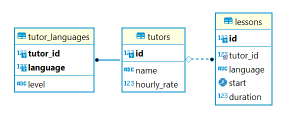

# Nyelviskola webszolgáltatás projekt

Az alkalmazás egy nyelviskola nyílvántartási rendszeréhez valósítja meg a backendet, amelyen keresztül adatbázisba rögzíthetők, lekérhetők és karbantarthatók nyelvtanárokhoz és tanórákhoz tartozó nyílvántartási adatok.

A languageschool egy háromrétegű alkalmazás, amely controller, service és repository rétegekből áll és RESTful API architektúrát valósít meg.

Az alkalmazás MariaDB adatbázishoz kapcsolódik.

## Entitások

- **Tutor**
    - id: *Long*
    - name: *String*
    - languages: *Map\<Language, LanguageLevel>*
    - lessons: *List\<Lesson>*
    - hourlyRate: *double*
- **Lesson**
    - id: *Long*
    - tutor: *Tutor*
    - language: *Language*
    - start: *LocalDateTime*
    - duration: *double*

## Enumok

- **Language**
    - Példányok: *ENGLISH, GERMAN, FRENCH, SPANISH, PORTUGUESE, ITALIAN, POLISH, CHINESE, JAPANESE, KOREAN*
- **LanguageLevel**
    - level: *int*
    - Példányok: *NONE(0), BEGINNER(1), INTERMEDIATE(2), CONVERSATIONAL(3), FLUENT(4), NATIVE(5)*

## Adatbázis táblák

## API végpontok

**[Swagger UI](http://localhost:8080/swagger-ui/index.html)**

- **TutorController**
    - `/api/tutors`
        - *GET:* Listázás név, nyelv és/vagy nyelvszint alapján
        - *POST:* Létrehozás
    - `/api/tutors/{id}`
        - *GET:* Lekérés ID alapján
        - *DELETE:* Törlés ID alapján
    - `/api/tutors/{id}/salary/{year}/{month}`
        - *GET:* Fizetés lekérése adott évre és hónapra ID alapján
    - `/api/tutors/{id}/name`
        - *PUT:* Név rögzítése ID alapján
    - `/api/tutors/{id}/hourly-rate`
        - *PUT:* Óradíj rögzítése ID alapján
    - `/api/tutors/{id}/languages`
        - *PUT:* Beszélt nyelvek rögzítése vagy törlése ID alapján
- **LessonController**
    - `/api/lessons`
        - *GET:* Listázás nyelv és/vagy nyelvszint alapján
        - *POST:* Létrehozás és ID szerint Tutorhoz rendelés
    - `/api/lessons/{id}`
        - *GET:* Lekérés ID alapján
        - *DELETE:* Törlés ID alapján
    - `/api/lessons/{id}/time-schedule`
        - *PUT:* Indulási idő és időtartam rögzítése ID alapján